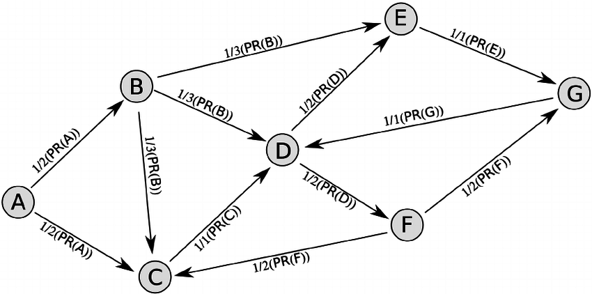

# PageRank with Hadoop and Spark

## Introduction
This GitHub repository contains the **implementation of the MapReduce PageRank algorithm**, i.e. a distributed algorithm for computing the PageRank of all the pages in a web graph, which is used to determine the importance of web pages in a search engine's results. 
It is optimized to take advantage of the parallel processing capabilities of both Hadoop framewrok in Java and the Spark framework both in Java and in Python.
Please, check the [Documentation](Documentation.pdf) for a complete view. 

## Couple of words about PageRank
PageRank is an algorithm that is used to determine the **importance or relevance of a web page in a search engine's results**. The algorithm was originally developed by Larry Page and Sergey Brin, the co-founders of Google.

The basic idea behind PageRank is that a page is considered more important if it is linked to by other important pages. The algorithm assigns a "PageRank score" to each page, which is determined by the **number and quality of links pointing to the page**.

The PageRank algorithm works as follows:

1. Each page is assigned an initial PageRank score, which is typically set to 1.

2. The algorithm then calculates the **"outgoing links" for each page**, which are the links that point to other pages from that page.

3. The PageRank score for each page is then **recalculated based on the scores of the pages that it links to**. Specifically, the algorithm distributes a portion of the page's PageRank score to each of the pages it links to, with the amount distributed to each page proportional to the number of outgoing links on that page.

4. This process is repeated multiple times, and the PageRank scores for all pages converge to a stable value.

5. The final PageRank scores for each page can then be used to **rank the pages in a search engine's results**, with the highest-scoring pages appearing at the top of the results.

The PageRank algorithm is a key component of Google's search algorithm, and it is used by other search engines and online recommendation systems as well.

Here there is an example of how PageRank score are distributed:

  

